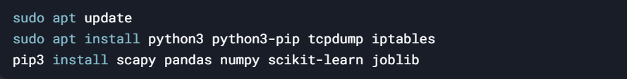

# 恶意流量检测平台
---
## 版本信息
* 操作系统：Ubuntu 22.04 
* 编程语言：Python 3.x
* 技术栈：
    1. 流量捕获：scapy（Python库，用于捕获和分析网络流量）。
    2. 特征提取：pandas、numpy（数据处理和分析）。
    3. 机器学习：scikit-learn（用于流量分类）。
    4. 日志记录：logging（Python标准库）。
    5. 流量拦截：iptables（通过Python调用系统命令）。
    6. 面向对象设计：Python3.x类和方法。

---

## 实现思路
* 2.1 流量捕获
使用scapy捕获网络流量，提取关键特征（如IP、端口、协议、包大小、时间戳等）。
* 2.2 特征提取
从原始流量中提取特征，例如：
1. 流量统计特征（如每秒包数、字节数）。
2. 协议分布（如TCP、UDP、ICMP的比例）。
3. 异常行为（如大量SYN包、重复IP）。
   
* 2.3 流量分类(分类的模型等bg训练后插入)
使用机器学习模型（如随机森林、SVM）对流量进行分类：正常流量 vs 恶意流量。
恶意流量类型（如DDoS、端口扫描、SQL注入）。
* 2.4 恶意流量拦截
使用iptables封锁恶意流量的源IP。记录拦截日志
* 2.5 日志记录
使用Python的logging模块记录检测和拦截的详细信息。

---
## 基本设置
1. 建议还是直接sudo安装到系统级目录下，因为suso执行默认是在root用户的环境下 
2. 
3.    
---

## 实现设计
1. 流量捕获
  1. 使用scapy库的sniff函数捕获网络流量。
  2. 提取每个数据包的关键信息（如源IP、目标IP、协议、包大小,时间戳，端口号。*但是这里可以添加更多高级特征的检查*）。
2. 流量分类（*用gpt推荐的scikit-learn做了个示范但是应该在这里要用bg的模型*）
3. 使用内核自己的工具iptables进行恶意流量拦截
4. 实时监控模块多线程捕获，定期捕获提取特征分类识别后拦截恶意流量
   
---
## 注意事项
1. 最好还是都用管理员权限sudo操作（iptables需要用管理员权限）
2. 看不到输出的原因有蛮多
   1. 检查自己的网络接口，默认传入的是eth0;（不过其实也可以修改下源码，直接动态扫描端口检查看看哪个合适就用哪个，不过那个库没去看）
   2. 流量分类器的训练，我也不知道
   
   
